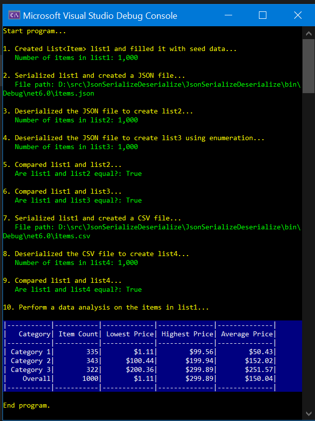

# Serialize and Deserialize JSON and List&lt;T&gt; objects with .NET and C#

This .NET 6 C# console app shows how to serialize and deserialize JSON and List&lt;T&gt; objects.
- Serialize a List&lt;T&gt; object to create a JSON file.
- Deserialize a JSON file to create a List&lt;T&gt; object.
- Compare two List&lt;T&gt; objects for equality.
- Serialize a List&lt;T&gt; object and create a CSV file.
- Deserialize a CSV file and create a List&lt;T&gt; object.
- Perform an analysis on a List&lt;T&gt; object using LINQ queries.

# How to Build
1. Clone the repository and open the destination folder.
2. Using Visual Studio, open the solution file: `csharp-json-serialize-deserialize-list-objects.sln`
3. Build and run the application.

# Sample Output (screenshot)

